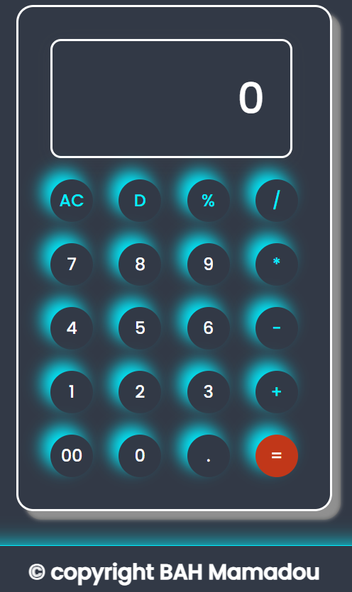

# Calculatrice JavaScript 🧮

Ceci est une calculatrice simple développée en JavaScript, HTML et CSS, qui permet d'effectuer les opérations arithmétiques de base ainsi que d'autres fonctionnalités telles que l'effacement et le traitement des décimales.

## Fonctionnalités

- Addition (+), soustraction (-), multiplication (*), division (/) et modulo (%).
- Prise en charge des décimales.
- Effacement de l'écran avec AC (All Clear).
- Effacement d'un caractère avec D (Delete).

## Capture d'écran 📸

## Utilisation 🚀

1. Ouvrez `index.html` dans votre navigateur web.
2. Utilisez les boutons numériques et les opérateurs pour effectuer des calculs.
3. Appuyez sur le bouton "=" pour obtenir le résultat.
4. Utilisez le bouton "AC" pour effacer l'écran et commencer un nouveau calcul.
5. Utilisez le bouton "D" pour effacer le dernier caractère.

## Opérations prises en charge ⚙️

- Addition: `+`
- Soustraction: `-`
- Multiplication: `*`
- Division: `/`
- Modulo: `%`

## Technologies utilisées 💻

- HTML
- CSS
- JavaScript

## Auteur ✍️

[BAH Mamadou](https://bahali21.github.io/BAHMamadou/)

## Licence 📝

Ce projet est sous licence [MIT License](LICENSE). N'hésitez pas à le modifier et à le distribuer comme bon vous semble.

